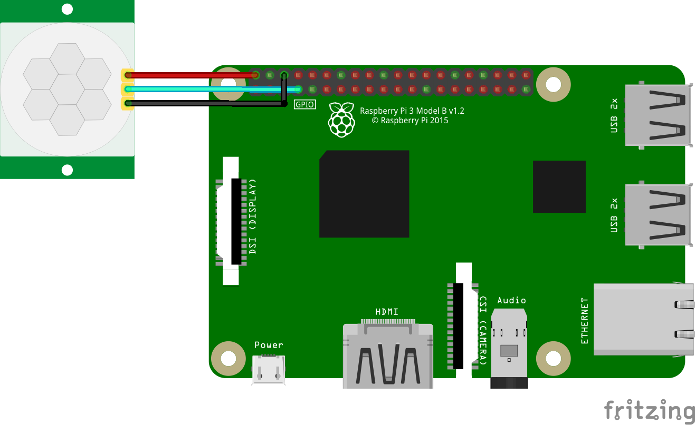

# santaCatch

**WARNING** 
**THIS SANTACATCH PROGRAM (GITHUB REPO _[santaCatch]("https://github.com/ryankim5/santaCatch")_ IS _REQUIRED_ TO RUN ON THE BUSTER RELEASE OF RASPBERRY PI OS (PREVIOUSLY CALLED RASPIAN) DUE TO THE LIBCAMERA CONVERTION FROM RASPISTILL, RASPIVID, AND ETC. IN THE BULLSEYE RELEASE.**

Well, this santaCatch program doesn't actually CATCH a Santa, like the name says. It's just a program that takes a video of Santa going down a chimney and giving _nice_ kids presents, if you are wondering if that "myth" or "real story" is real. 

**CIRCUIT DIAGRAM (WITHOUT PiCamera V2 CONNECTED TO CSI PORT):**
